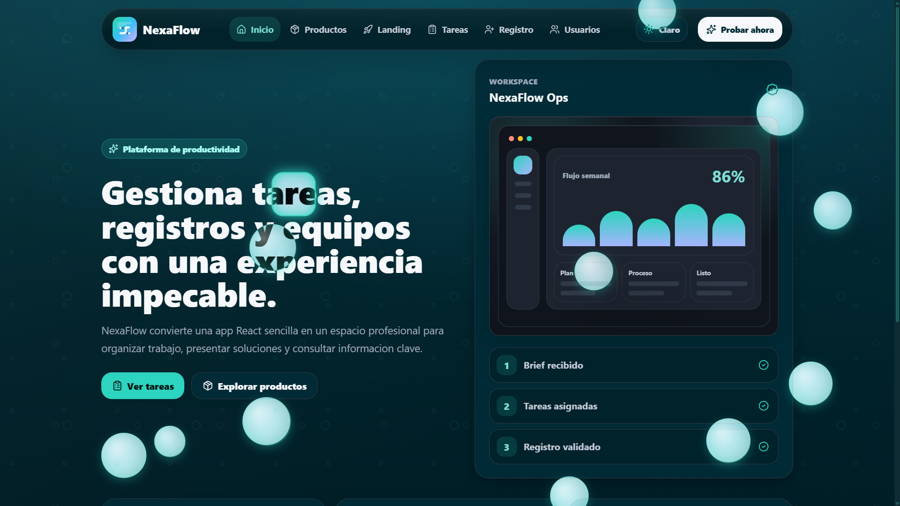
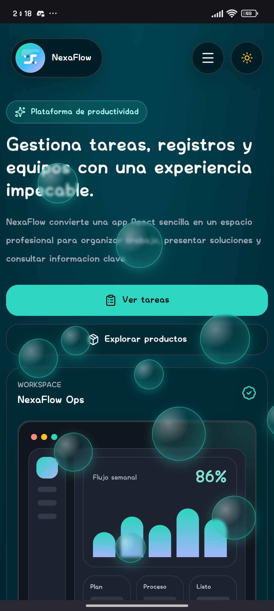

# 🌊 NexaFlow

**NexaFlow** es una plataforma premium y moderna para la gestión de usuarios y tareas. Diseñada con un enfoque "artisanal" (artesanal) y minimalista, ofrece una experiencia de usuario fluida, inmersiva y con un alto nivel de pulido visual (incluyendo cursores personalizados, animaciones dinámicas de burbujas submarinas y soporte nativo para temas oscuros). 

No es solo una aplicación funcional; es una demostración de diseño UI/UX de alta fidelidad combinado con una arquitectura Full-Stack robusta.

## 🚀 Características Principales
- **Interfaz Premium:** Efectos *glassmorphism*, animaciones fluidas, modo oscuro nativo, y cursor magnético personalizado.
- **Gestión de Registros:** Formulario de registro avanzado con validación en tiempo real y selector inteligente de números de teléfono internacionales.
- **Gestión de Tareas:** Módulo completo de tareas con conexión en tiempo real a la base de datos.
- **Totalmente Responsivo:** Experiencia impecable tanto en navegadores de escritorio como en dispositivos móviles.

## 🛠️ Tecnologías Utilizadas

Este proyecto utiliza el stack **MERN** modernizado, completamente contenerizado para un despliegue sin fricciones:

- **Frontend:** React + Vite, CSS3 puro (Variables, Animaciones Keyframes), React Hook Form.
- **Backend:** Node.js, Express.js.
- **Base de Datos:** MongoDB (con Mongoose).
- **Infraestructura:** Docker & Docker Compose.

## 📸 Vistazo a la Interfaz


*Diseño responsivo y elegante en la vista de escritorio.*


*Formulario con validación inteligente de teléfono en vista móvil.*

## ⚙️ Cómo Ejecutar el Proyecto

Levantar NexaFlow en tu propia máquina es increíblemente fácil gracias a Docker. No necesitas instalar Node, ni configurar MongoDB manualmente. 

Sigue estos dos pasos:

1. Asegúrate de tener [Docker Desktop](https://www.docker.com/products/docker-desktop/) instalado y ejecutándose.
2. Abre tu terminal en la raíz del proyecto y ejecuta:

```bash
docker-compose up -d --build
```

**¡Eso es todo!** 
- El Frontend (React) estará disponible en: `http://localhost:5174`
- El Backend (API) estará escuchando en: `http://localhost:5000`

Para detener los contenedores y limpiar la terminal, simplemente usa:
```bash
docker-compose down
```
